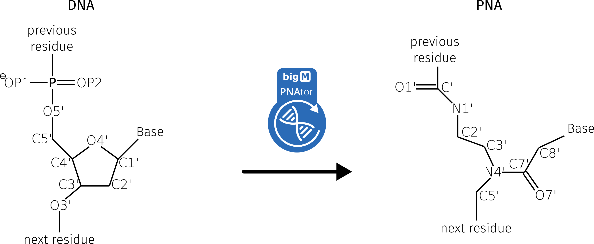

# PNAtor

## Decription

[Peptide nucleic acid (PNA)](https://en.wikipedia.org/wiki/Peptide_nucleic_acid) are artificial DNAs or RNAs with an uncharged pseudopeptide backbone. 
In 1991, the PNA was described for the first time by Nielsen et al. (1). 
The sugar phosphate backbone is completely replaced by the polyamide 
backbone. The backbone of the PNA consists of 2-(aminoethyl)glycine units, 
the nucleobases adenine, cytosine, guanine, thymine and uracil are 
covalently linked to the backbone by an ethenone (1).




In 1998, Sen and Nielsen published a theoretical approach describing 
how DNA can be converted into PNA (2). This approach was based on four 
main steps: I) exchanging atoms of the backbone, II) removing atoms 
that are not present in the PNA structure, III) calculating missing atoms and 
VI) adding missing hydrogen atoms. 
The last step (nr. VI) was not implemented. Hydrogen atoms can be 
added with [Ambertools16](http://ambermd.org/) (3).

For the implementation the  [SiNGA](https://github.com/singa-bio/singa) Framework was used to develop the 
PNAtor. The [SiNGA](https://github.com/singa-bio/singa) Framework allows a comfortable handling by 
predefined methods and functions for the handling of 3D structures.

RNA structures generated with the [RNAComposer](http://rnacomposer.cs.put.poznan.pl/)
 (4) can also be converted into PNA.

References:

(1) Nielsen, Peter E., et al. "Sequence-selective recognition of DNA by strand displacement with a thymine-substituted polyamide." Science 254.5037 (1991): 1497-1500.

(2) Sen, Srikanta, and Lennart Nilsson. "Molecular dynamics of duplex systems involving PNA: structural and dynamical consequences of the nucleic acid backbone." Journal of the American Chemical Society 120.4 (1998): 619-631.

(3) Case, D. A., et al. "AmberTools 16, University of California, San Francisco, 2016." There is no corresponding record for this reference.

(4) Popenda, Mariusz, et al. "Automated 3D structure composition for large RNAs." Nucleic acids research 40.14 (2012): e112-e112.
## Quick start

- clone repro
- navigate to PNAGenerator.java in IDE of your choice
- choose your PDB Structure (DNA/RNA) 

```java
Structure structure = StructureParser.online()
        .pdbIdentifier("1OLD")
        .everything()
        .setOptions(StructureParserOptions.withSettings(
            StructureParserOptions.Setting.OMIT_HYDROGENS))
        .parse();

```
- execute the ```convertToPNAStructure(structure)``` method
- write reulst file
```java
try {
    StructureWriter.writeLeafSubstructureContainer(structure.getFirstModel(), 
        Paths.get("path/to/outputPDB.pdb"));
} catch (IOException e) {
    e.printStackTrace();
}
```
## Requirements
Make sure you have the Java 8 or later installed.

